# RAHC-LoRA Architecture

## Fully understandable system design for implementation and research validation

**Project:** Reward-Aware Hierarchical Consolidation for Continual Reinforcement Learning of Language Models  
**Audience:** Researchers, software engineers, thesis supervisors, and coding agents  
**Primary environment:** Python 3.11, PyTorch, VS Code  
**Related documents:** `Project.md` and `Goal.md`

---

## 1. Purpose of this document

This document explains how RAHC-LoRA should work as a complete system.

It connects:

- The catastrophic-forgetting research problem.
- The mathematical method.
- The Python package structure.
- Runtime data flow.
- State ownership and checkpointing.
- Baselines and ablations.
- Testing, deployment, security, and scaling.

Use the documents as follows:

| Document | Purpose |
|---|---|
| `Project.md` | Scientific specification, repository structure, experiments, and completion criteria |
| `Goal.md` | Step-by-step execution prompt for a coding agent |
| `architecture.md` | Detailed explanation of how components interact and where each responsibility belongs |

If this file conflicts with a mathematical definition in `Project.md`, `Project.md` is authoritative.

---

## 2. Problem in plain language

One language model is trained sequentially on several RL tasks. The model may learn the current task but lose behaviours needed for earlier tasks.

Example:

```text
Task 1: Mathematics
Task 2: Science
Task 3: Code generation
Task 4: Instruction constraints
```

After Task 3, code performance may improve while mathematics performance falls. This is catastrophic forgetting.

RAHC-LoRA tries to balance two requirements:

1. **Plasticity:** update the policy enough to learn the current task.
2. **Stability:** restrict updates that would damage important old behaviours.

The architecture uses two complementary protections:

- **Functional protection:** preserve outputs on a small memory of old prompts.
- **Parameter protection:** resist destructive movement in important effective LoRA weights.

Protection is increased only when current-task learning conflicts with old behaviour.

---

## 3. Architectural principles

### 3.1 One policy, not one adapter per task

The primary method uses:

- One frozen backbone.
- One shared LoRA adapter.
- One optional value head when the RL algorithm requires it.

Task-specific adapter growth is not part of the primary architecture.

### 3.2 Behaviour and parameters are different

A small parameter change can cause a large behavioural change, and a large parameter change may leave behaviour nearly unchanged. Therefore:

- Anchor KL protects behaviour.
- Importance-weighted consolidation protects sensitive effective weights.

Neither mechanism is assumed sufficient without ablation evidence.

### 3.3 Effective LoRA weight is the protected object

LoRA represents a weight update as:

```text
DeltaW = scale * B @ A
scale = alpha / rank
```

The architecture protects `DeltaW`, not `A` and `B` independently. This avoids sensitivity to equivalent factor rescaling.

### 3.4 Persistent state must remain bounded

The method may not store:

- A complete model for every task.
- A dense importance matrix for every task.
- An unlimited replay buffer.

It stores:

- One current LoRA policy.
- One consolidated reference LoRA state.
- Factorized importance vectors.
- One fixed-capacity anchor memory.
- Small controller and experiment state.

### 3.5 Every component must be removable

The architecture supports configuration-only ablations. Disabling a component must not require editing the trainer.

### 3.6 Measurement is part of the architecture

The system is incomplete without:

- Evaluation after every task.
- A full task-by-task performance matrix.
- Current-task plasticity metrics.
- General-capability evaluation.
- Compute, memory, and storage measurements.

---

## 4. Glossary

| Term | Meaning |
|---|---|
| Backbone | Frozen pretrained language-model parameters |
| Policy | Backbone plus the currently trained LoRA adapter |
| Task stream | Ordered sequence of RL tasks |
| Rollout | A model-generated response and its associated metadata |
| Reward | Deterministic or reproducibly computed task score |
| Advantage | Normalized relative quality signal used by the RL loss |
| Anchor | Stored old prompt or state with compact reference behaviour |
| Functional retention | Preserving old policy outputs on anchor states |
| Effective LoRA weight | The actual low-rank weight update `scale * B @ A` |
| Importance | Estimated sensitivity of old knowledge to effective-weight movement |
| Conflict | Negative cosine agreement between current and retention gradients |
| Consolidation state | Reference LoRA factors plus factorized importance |
| Task boundary | Point after one task finishes and before the next begins |
| Performance matrix | Score on every task after every training stage |

---

## 5. System context

The system receives an experiment configuration and an ordered task stream. It produces a continual LoRA policy, compact retention state, checkpoints, and research evidence.

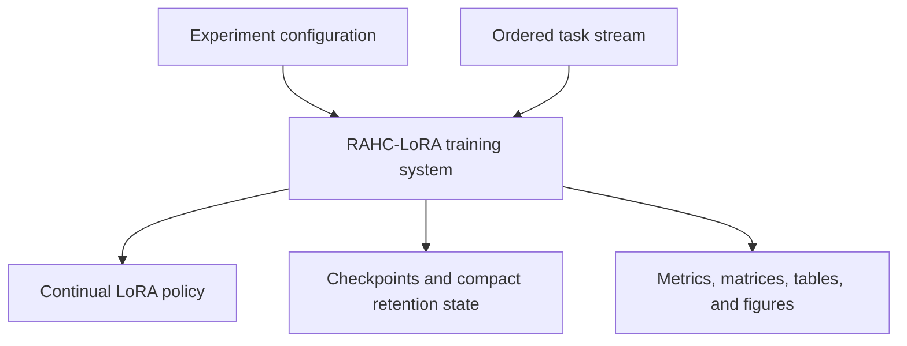

### External dependencies

| Dependency | Responsibility | Boundary rule |
|---|---|---|
| Model provider or local checkpoint | Supplies backbone and tokenizer | Pin identifier and revision |
| Dataset source | Supplies task data | Pin revision and save split fingerprints |
| PyTorch | Tensor computation and autograd | Project code owns scientific equations |
| Transformers and PEFT | Model and LoRA integration | Wrap behind project interfaces |
| TRL or internal GRPO | RL implementation support | Do not expose trainer-specific APIs throughout the repository |
| Accelerate or distributed runtime | Device placement and distributed execution | Results must agree with single-process reference within tolerance |
| Optional experiment tracker | Mirrors logs | Local machine-readable artifacts remain authoritative |

---

## 6. High-level component architecture

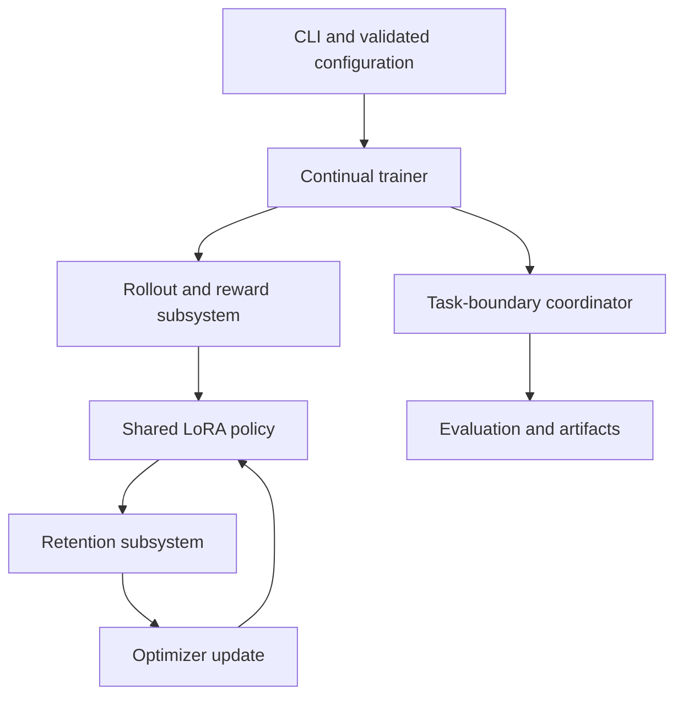

The `ContinualTrainer` coordinates components but does not implement their internal scientific logic.

### Component summary

| Component | Main input | Main output | Owns persistent state? |
|---|---|---|---|
| Configuration system | YAML overrides | Frozen resolved configuration | Yes, saved with run |
| Task registry | Task ID | Task adapter | No |
| Rollout engine | Prompts and policy | Responses and log probabilities | Temporary only |
| Reward adapters | Examples and responses | Raw rewards | No |
| Advantage module | Grouped rewards | Normalized advantages | Optional running statistics |
| Policy model | Tokenized inputs | Logits and log probabilities | LoRA and optional value head |
| Gradient capture | Current and anchor losses | Per-layer effective-gradient summaries | Temporary only |
| Importance recorder | Effective gradients and observed steps | Importance accumulator | Yes |
| Factorizer | Importance accumulator | Row and column factors | Yes |
| Anchor memory | Candidate old behaviours | Fixed-size anchor batches | Yes |
| Distillation module | Current and stored distributions | Anchor KL loss | No |
| Conflict controller | Current and anchor gradients | Layer coefficients | Small controller state |
| Dual controller | Observed anchor KL | Functional multiplier | Yes |
| Penalty module | Current/reference factors and importance | Parameter penalty | No |
| Evaluator | Checkpoint and task suite | Scores and matrix entries | Performance matrix |
| Checkpoint manager | All state owners | Atomic checkpoint | Manifest and checksums |

---

## 7. Layered software architecture

Dependencies flow downward. Lower layers must not import orchestration or CLI code.

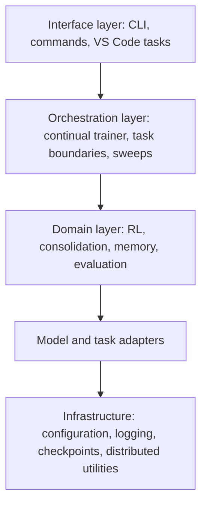

### Allowed dependency direction

| Layer | May depend on | Must not depend on |
|---|---|---|
| CLI | Orchestration and configuration | Internal tensor implementation details |
| Orchestration | Domain interfaces, models, infrastructure | Individual task parsing details |
| Domain | Models, typed schemas, infrastructure utilities | CLI or VS Code files |
| Task adapters | Task and reward base interfaces | Continual trainer internals |
| Infrastructure | Standard libraries and narrow external APIs | Research-domain modules |

Circular imports are architecture violations.

---

## 8. Package-to-responsibility map

| Package | Responsibility |
|---|---|
| `rahc_lora.config` | Typed configuration, composition, validation, immutable resolved config |
| `rahc_lora.models` | Backbone loading, LoRA attachment, policy interface, checkpointable model state |
| `rahc_lora.rl` | Rollouts, sampling, rewards-to-advantages, GRPO loss, policy statistics |
| `rahc_lora.consolidation` | Effective weights, gradients, importance, factorization, penalty, conflict, dual control |
| `rahc_lora.memory` | Anchor records, selection, fixed capacity, compact reference logits, distillation |
| `rahc_lora.tasks` | Dataset loading, prompt formatting, task splits, task-level metrics |
| `rahc_lora.rewards` | Deterministic reward implementations and secure code testing |
| `rahc_lora.evaluation` | Task evaluation, continual metrics, general capabilities, efficiency measurements |
| `rahc_lora.training` | Sequential orchestration, task transitions, callbacks, resume |
| `rahc_lora.utils` | Logging, seeds, distributed reductions, numeric checks, manifests |

### Thin entry points

`scripts` and the CLI may:

- Resolve configuration.
- Call package functions.
- Return process exit codes.

They may not:

- Define losses.
- Parse task answers.
- Calculate forgetting.
- Implement retention logic.
- Store hidden experiment defaults.

---

## 9. End-to-end lifecycle

The complete experiment follows this lifecycle:

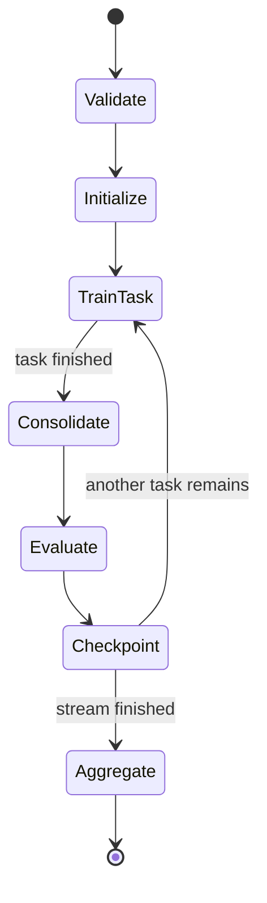

### Lifecycle stages

1. **Validate:** reject invalid configurations and unavailable required capabilities.
2. **Initialize:** load the model, attach LoRA, seed all generators, and create empty retention state.
3. **Train task:** run RL updates on only the current task's training split.
4. **Consolidate:** finalize importance, update reference LoRA factors, and refresh anchor memory.
5. **Evaluate:** score every learned task and the fixed general-capability suite.
6. **Checkpoint:** atomically save all model, optimizer, retention, data, and random state.
7. **Aggregate:** calculate cross-seed and cross-order research results after all requested runs complete.

---

## 10. What happens on the first task

The first task has no old behaviour to retain.

Therefore:

- Anchor memory is empty.
- Anchor KL is zero.
- Previous importance is zero.
- Parameter-consolidation penalty is zero.
- Conflict coefficients are zero.
- The method behaves like standard RL-LoRA.

During the first task, the recorder observes useful effective-weight movements. At the first task boundary, the system creates:

- Initial factorized importance.
- Initial reference LoRA factors.
- Initial anchor memory.

This property is important for debugging. If the first-task RAHC-LoRA loss differs from standard RL-LoRA while all retention components have no previous state, the implementation is probably wrong.

---

## 11. One optimizer update

### 11.1 Sequence view

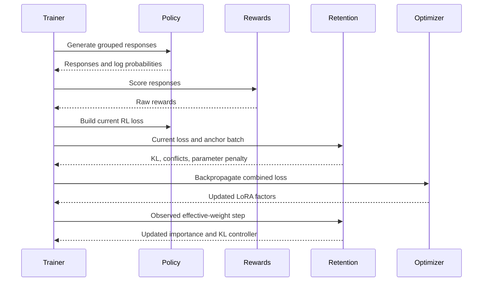

### 11.2 Detailed step order

The exact order matters.

1. Sample a current-task minibatch.
2. Generate grouped responses with the current policy.
3. Calculate raw deterministic rewards.
4. Normalize and clip advantages.
5. Build `L_RL_current`.
6. If memory is nonempty, sample an anchor minibatch.
7. Run the policy on anchor inputs.
8. Build `L_anchor_KL` from stored compact reference distributions.
9. Calculate detached effective-gradient summaries for current and anchor objectives.
10. Calculate per-layer conflicts.
11. Calculate the effective-weight consolidation penalty against the task-start reference state.
12. Form the combined objective.
13. Snapshot the pre-step LoRA factors required by the importance recorder.
14. Clear old gradients.
15. Backpropagate the combined objective.
16. Apply gradient clipping if configured and log the clipping event.
17. Run the optimizer step.
18. Calculate the observed effective-weight movement from pre-step to post-step factors.
19. Update reward-aware importance statistics using the current RL gradient and observed movement.
20. Update the smoothed anchor KL and dual multiplier.
21. Release temporary activations, gradient summaries, and factor snapshots.
22. Write structured step metrics.

### 11.3 Correctness-first gradient strategy

The initial implementation may use separate gradient queries:

```text
current effective gradients = grad(L_RL_current)
anchor effective gradients = grad(L_anchor_KL)
update gradients = grad(L_total)
```

This can require multiple backward or `autograd.grad` passes. It is acceptable for the reference implementation because correctness is more important than throughput.

After the reference path passes all numerical tests, an optimized path may reuse graphs or gradient summaries. The optimized path must match the reference path within tolerance.

---

## 12. Combined objective architecture

```text
L_total = L_RL_current
        + lambda_functional * L_anchor_KL
        + lambda_parameter * sum_l(c_l * R_l)
```

### Responsibility split

| Term | Produced by | Controlled by |
|---|---|---|
| `L_RL_current` | RL loss module | RL algorithm configuration |
| `L_anchor_KL` | Memory distillation module | Anchor batch and reference distributions |
| `lambda_functional` | Dual controller | Target KL budget |
| `R_l` | Consolidation penalty module | Current/reference LoRA factors and importance |
| `c_l` | Conflict controller | Current and anchor effective gradients |
| `lambda_parameter` | Method configuration | Hyperparameter or ablation |

### Autograd rules

- Gradients must flow through `L_RL_current`.
- Gradients must flow through the current-policy side of `L_anchor_KL`.
- Gradients must flow through current LoRA factors in `R_l`.
- `c_l` must be detached.
- Stored reference distributions are constants.
- Reference LoRA factors are constants.
- Importance factors `p_l` and `q_l` are constants during an optimizer update.
- The dual-controller update is outside autograd.

---

## 13. Policy model architecture

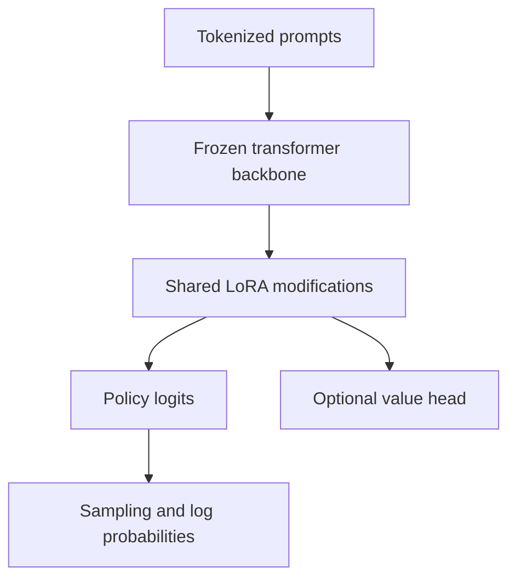

### Trainable state

Primary configuration:

- LoRA matrices `A_l` and `B_l` for configured target linear layers.
- Optional value head only when required by the RL algorithm.

Frozen state:

- Backbone weights.
- Tokenizer.
- Reference LoRA factors used by consolidation.

### Policy interface

The rest of the codebase should use a project-owned policy interface with methods similar to:

```python
class Policy(Protocol):
    def generate(self, batch: PromptBatch, generation: GenerationConfig) -> RolloutBatch: ...
    def token_logprobs(self, batch: TokenBatch) -> Tensor: ...
    def named_lora_layers(self) -> Iterable[LoRALayerRef]: ...
    def trainable_state_dict(self) -> dict[str, Tensor]: ...
```

Do not allow task adapters or trainers to reach directly into provider-specific model internals.

---

## 14. Task and reward architecture

### 14.1 Dataset allocation

The architecture treats dataset role as a validated part of configuration, not an informal convention.

| Stage | Family | Dataset | Role | Reward or metric |
|---|---|---|---|---|
| HLoRA reproduction | General language | Fixed versioned subset of The Pile | Supervised general reference | Perplexity or source protocol |
| HLoRA reproduction | Science | SciQ | Supervised domain task | Source-paper protocol |
| HLoRA reproduction | Physical commonsense | PiQA | Supervised domain task | Source-paper protocol |
| HLoRA reproduction | Medical | MedMCQA | Supervised domain task | Source-paper protocol |
| Continual RL | Mathematics | GSM8K | Task 1 in primary order | Normalized exact answer |
| Continual RL | Science | ARC-Challenge | Task 2 in primary order | Exact option match |
| Continual RL | Code | MBPP | Task 3 in primary order | Hidden-test pass fraction |
| Continual RL | Instruction constraints | Custom Verifiable Constraint Training dataset | Task 4 in primary order | Satisfied-constraint fraction |
| General evaluation | Instruction following | Official IFEval | Evaluation only | Official strict and loose metrics |

Primary order:

```text
GSM8K -> ARC-Challenge -> MBPP -> Custom Verifiable Constraints
```

Preselected alternate orders:

```text
MBPP -> GSM8K -> Constraints -> ARC-Challenge
Constraints -> ARC-Challenge -> GSM8K -> MBPP
```

The official IFEval dataset is never available through a training or anchor-candidate data loader.

### 14.2 Custom constraint-training dataset

The custom dataset is generated from a versioned grammar and validator library. It contains new prompts with objectively verifiable requirements such as:

- Keyword counts.
- Bullet counts.
- Forbidden words.
- Required endings.
- Length ranges.
- Required sections.
- JSON schema requirements.

The generator stores:

```text
generator_version
template_family
constraint_types
random_seed
validator_version
prompt_hash
split
```

Architecture rules:

- Do not copy or paraphrase official IFEval prompts.
- Create disjoint training, validation, anchor-candidate, and held-out custom test splits.
- Split by prompt and template family across all split boundaries.
- Run exact and normalized-text overlap checks against official IFEval.
- Freeze the generator and split manifests before the main experiments.
- Do not revise generation templates after inspecting official IFEval results.

The Task 4 performance-matrix score comes from the held-out custom test split. Official IFEval is an additional external generalization evaluation and remains unavailable to training and anchor loaders.

### 14.3 Task adapter

Each task owns:

- Dataset identifiers and pinned revisions.
- Split construction.
- Prompt formatting.
- Response parsing.
- Reward selection.
- Task-specific aggregate metrics.

Each task must not own:

- The training loop.
- LoRA configuration.
- Importance logic.
- Continual metrics.

### 14.4 Reward pipeline

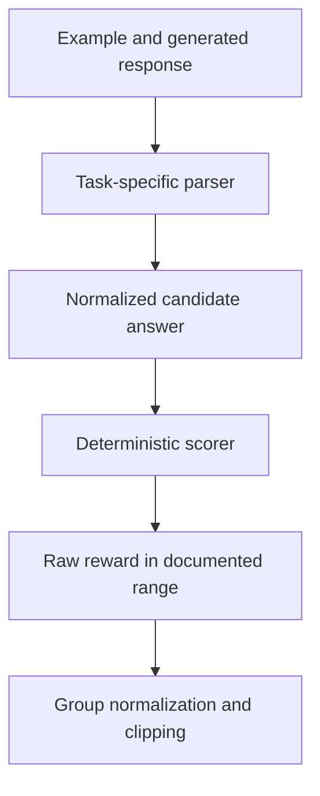

### 14.5 Code reward security boundary

Generated code is untrusted.

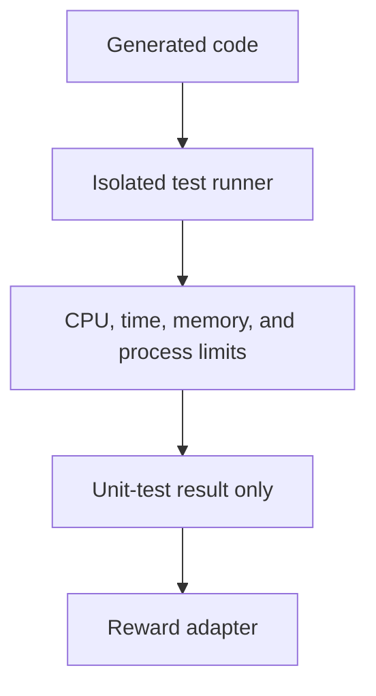

The isolated runner must have:

- No network access.
- A disposable working directory.
- Read-only test fixtures where possible.
- Strict process timeout.
- CPU and memory limits.
- Restricted child processes.
- Captured and size-limited output.
- No access to training credentials or unrelated files.

---

## 15. Rollout and GRPO architecture

### 15.1 Rollout batch

A rollout record should include:

```text
task_id
example_id
prompt_token_ids
response_token_ids
response_text
old_policy_logprobs
sampling_metadata
raw_reward
normalized_reward
advantage
valid_token_mask
policy_version
```

### 15.2 Grouping invariant

For GRPO, all responses belonging to one prompt group must remain together through:

- Generation.
- Reward calculation.
- Advantage normalization.
- Distributed sharding.

Splitting one group across ranks without a correct cross-rank reduction changes the algorithm.

### 15.3 Advantage handling

The advantage module must:

- Preserve raw rewards.
- Normalize within the configured group.
- Use epsilon-safe scale estimates.
- Clip using configuration.
- Log zero-variance groups.
- Return finite values or fail the step.

The effective-gradient recorder receives the gradient of the real RL objective after this advantage processing.

---

## 16. Effective-weight and gradient architecture

### 16.1 Tensor shapes

For a LoRA target linear layer:

```text
base weight W:       [O, I]
LoRA A:              [R, I]
LoRA B:              [O, R]
effective DeltaW:    [O, I]
row importance p:    [O]
column importance q: [I]
```

Where:

- `O` is output dimension.
- `I` is input dimension.
- `R` is LoRA rank.

### 16.2 Effective gradient

For a linear transformation `Y = X @ W.T`, the gradient with respect to the effective weight is conceptually:

```text
G_W = grad_Y.T @ X
```

The implementation may obtain this using controlled forward and backward hooks on configured LoRA target modules.

### 16.3 Gradient-capture modes

Support two explicit modes:

| Mode | Purpose | Memory profile |
|---|---|---|
| `dense_reference` | Small-model numerical oracle | May materialize `[O, I]` temporarily |
| `chunked_hooks` | Main experiments | Processes row blocks and avoids persistent dense state |

No mode may silently replace another.

### 16.4 Temporary data lifecycle

The gradient-capture subsystem may temporarily own:

- Selected layer inputs.
- Upstream output gradients.
- Dense or chunked effective-gradient summaries.
- Pre-step LoRA factor snapshots.

It must release these after the importance update. None belongs in persistent consolidation state.

### 16.5 Distributed rule

In distributed training:

1. Calculate local effective-gradient summaries.
2. Reduce them using the mathematically correct mean or sum.
3. Calculate conflict and importance from the globally agreed summary.
4. Ensure every rank obtains identical persistent consolidation state.

Applying nonlinear clipping before versus after reduction can change the result. The implementation must choose one definition, test it, and document it. The recommended reference definition reduces the effective gradient first, then applies the importance equation.

---

## 17. Reward-aware importance recorder

### 17.1 Inputs and outputs

Inputs per protected layer:

- Effective gradient from `L_RL_current`.
- Pre-step LoRA factors.
- Post-step LoRA factors.
- LoRA scale.
- Existing EMA importance state.

Outputs:

- Updated transient importance accumulator.
- Layer summary metrics.
- Non-finite or clipping diagnostics.

### 17.2 Update

```text
delta_step = DeltaW_after - DeltaW_before

raw_score = relu(-effective_gradient * delta_step)
            / (delta_step^2 + epsilon)

score = beta * previous_score
        + (1 - beta) * robust_clip(raw_score)
```

Interpretation:

- `-gradient * movement` estimates whether the observed movement helped reduce the current RL loss.
- `relu` prevents harmful or noisy movement from being marked important.
- The denominator normalizes for movement magnitude.
- EMA reduces step-level reward noise.

### 17.3 Chunked update

For the main path:

1. Reconstruct one row block of `DeltaW_before`.
2. Reconstruct the same block of `DeltaW_after`.
3. Obtain the matching effective-gradient block.
4. Calculate the score block.
5. Accumulate row and column sufficient statistics.
6. Discard the block.

The system must not retain the full score matrix after factorization statistics are collected.

---

## 18. Factorized consolidation state

### 18.1 Rank-one representation

For layer `l`:

```text
S_l ~= p_l @ q_l.T
```

Both vectors are nonnegative.

One practical mass-preserving construction is:

```text
row_mass = sum(S, axis=1)
col_mass = sum(S, axis=0)
total_mass = sum(S)

p = row_mass
q = col_mass / max(total_mass, epsilon)
```

Then `sum(p @ q.T)` approximately preserves total score mass. The exact normalization must be unit-tested and documented.

### 18.2 Persistent layer state

```python
@dataclass
class LayerConsolidationState:
    layer_name: str
    row_importance: Tensor
    column_importance: Tensor
    reference_lora_a: Tensor
    reference_lora_b: Tensor
    lora_scale: float
    updates_seen: int
    normalization_metadata: dict[str, float]
```

### 18.3 State update policy

Importance is accumulated during a task and consolidated at the task boundary.

The task-boundary coordinator must define how new and historical importance combine. The default is a configurable EMA or normalized cumulative update, not replacement without history.

The policy must be identical across methods and task orders unless the experiment explicitly studies it.

---

## 19. Efficient consolidation penalty

### 19.1 Direct mathematical definition

```text
D = scale * (B @ A - B_ref @ A_ref)

R = || diag(sqrt(p))
       @ D
       @ diag(sqrt(q)) ||_F^2
```

### 19.2 Low-rank computation

Define:

```text
X = [diag(sqrt(p)) @ B,
     -diag(sqrt(p)) @ B_ref]

Y = [A @ diag(sqrt(q));
     A_ref @ diag(sqrt(q))]
```

Then:

```text
R = scale^2 * trace((X.T @ X) @ (Y @ Y.T))
```

This operates mainly on matrices with width or height `2R`, avoiding a persistent `[O, I]` difference matrix.

### 19.3 Penalty service contract

```python
class ConsolidationPenalty(Protocol):
    def layer_penalty(
        self,
        current: LoRAFactors,
        reference: LoRAFactors,
        importance: FactorizedImportance,
    ) -> Tensor: ...
```

The result is a scalar differentiable with respect to current `A` and `B` only.

---

## 20. Anchor memory architecture

### 20.1 Why anchors exist

Parameter importance is an indirect estimate. Anchors directly measure whether old policy behaviour changes on selected historical states.

### 20.2 Anchor record

```python
@dataclass
class AnchorRecord:
    anchor_id: str
    task_id: str
    example_id: str
    prompt_token_ids: list[int]
    reference_token_ids: list[int]
    topk_token_ids: list[list[int]]
    topk_logprobs: list[list[float]]
    residual_probability_mass: list[float]
    reward_at_capture: float
    difficulty_bucket: str
    policy_version: str
    selection_key: int
    metadata: dict[str, str | int | float]
```

Raw prompt text is optional. Token IDs or privacy-safe representations may be used when permitted by the tokenizer and data policy.

### 20.3 Memory selection pipeline

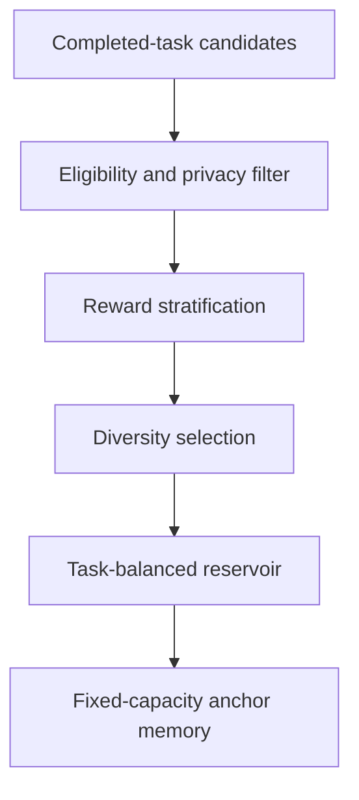

### 20.4 Budget invariant

After every insertion and rebalance:

```text
record_count <= configured_capacity
serialized_bytes <= configured_byte_budget, when set
```

The memory manager must expose both counts.

### 20.5 Sampling

Sampling receives an explicit `torch.Generator`. The generator state belongs in the checkpoint.

Sampling may be:

- Uniform across task-balanced partitions.
- Reward-stratified within a task.
- Weighted toward underrepresented tasks.

The selected rule is configuration-controlled and logged.

---

## 21. Compact behavioural KL

### 21.1 Reference representation

For each selected output position, store:

- Top-k token IDs.
- Their reference probabilities or log probabilities.
- Total residual probability mass for all other tokens.

This creates `k + 1` probability buckets.

### 21.2 Coarse-grained forward KL

For stored top-k tokens `K`:

```text
p_ref_rest = 1 - sum_i_in_K(p_ref_i)
p_cur_rest = 1 - sum_i_in_K(p_cur_i)

KL = sum_i_in_K p_ref_i * log(p_ref_i / p_cur_i)
   + p_ref_rest * log(p_ref_rest / p_cur_rest)
```

Use epsilon-safe probabilities and renormalize only according to the documented implementation.

### 21.3 Behavioural loss path

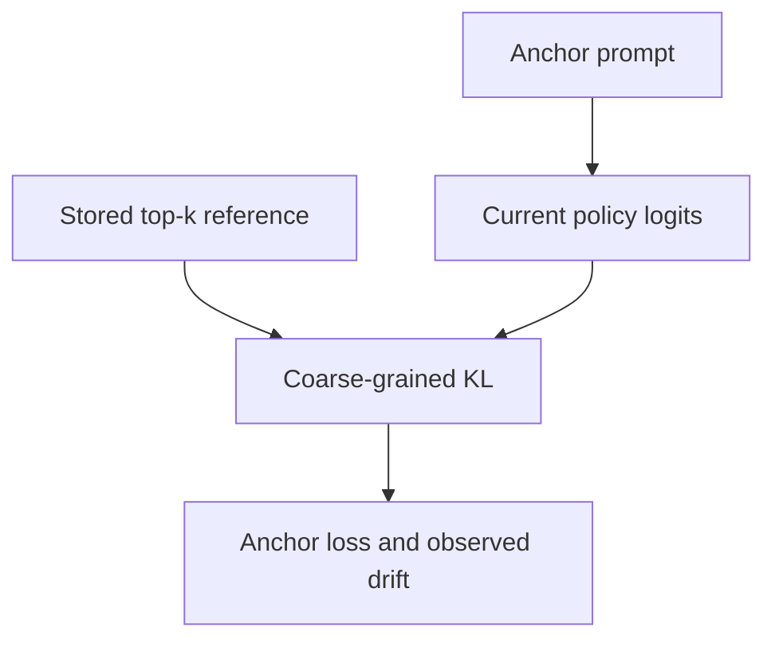

### 21.4 Validation

- Identical distributions produce near-zero KL.
- Moving probability away from high-reference tokens increases KL.
- Top-k plus residual mass sums to one within tolerance.
- Padding and non-response tokens do not contribute.

---

## 22. Conflict-aware layer controller

### 22.1 Purpose

Static protection can block useful transfer. The conflict controller activates parameter protection mainly when the current-task direction opposes old-behaviour retention.

### 22.2 Definition

```text
conflict_l = max(
    0,
    -cosine(G_current_l, G_anchor_l)
)

importance_mass_l = sqrt(sum(p_l) * sum(q_l))

c_l = normalize_and_clip(importance_mass_l * conflict_l)
```

### 22.3 Expected cases

| Gradient relation | Cosine | Conflict |
|---|---:|---:|
| Same direction | Positive | 0 |
| Orthogonal | About 0 | 0 |
| Opposite direction | Negative | Positive |
| Either norm below threshold | Undefined numerically | Forced to 0 |

### 22.4 Ownership

The controller owns:

- Optional EMA of conflict statistics.
- Normalization metadata.
- Clipping counters.

It does not own:

- LoRA factors.
- Anchor records.
- Importance vectors.

---

## 23. Adaptive functional-retention controller

### 23.1 Purpose

The dual controller adjusts behavioural protection to keep anchor drift near a target budget.

### 23.2 State and update

```text
kl_ema = beta * previous_kl_ema
       + (1 - beta) * observed_anchor_kl

lambda_functional = clamp(
    lambda_functional
    + dual_lr * (kl_ema - target_kl),
    0,
    max_lambda
)
```

### 23.3 Safety state

The controller tracks:

- Current multiplier.
- Smoothed KL.
- Consecutive saturated steps.
- Total updates.

If the multiplier stays at its maximum while KL remains above target for the configured patience, the trainer must stop with a clear diagnostic. Continuing would hide a failed retention constraint.

---

## 24. Task-boundary architecture

### 24.1 Sequence view

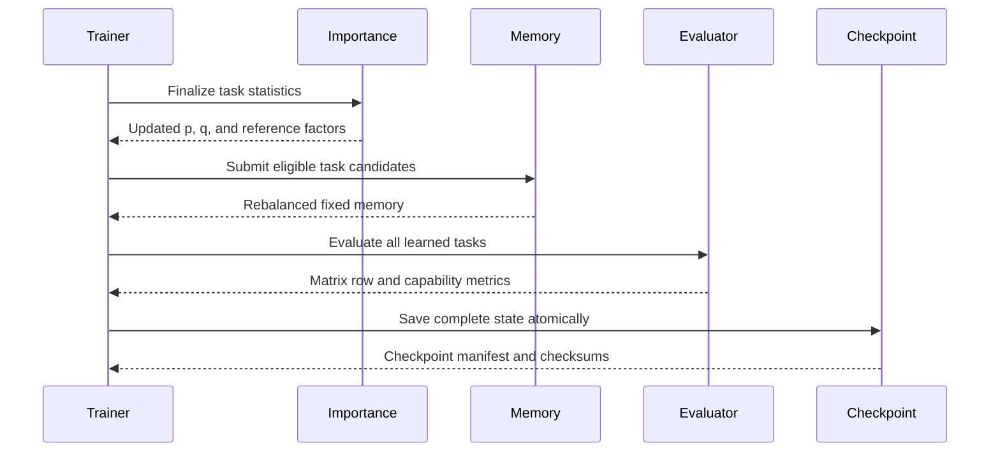

### 24.2 Boundary order

1. Stop current-task rollout collection.
2. Flush pending optimizer and metric state.
3. Consolidate task importance with historical importance.
4. Set current LoRA factors as the reference for the next task.
5. Generate eligible anchor candidates only from the completed task's training data.
6. Store compact reference behaviour under the current policy version.
7. Rebalance memory under the global budget.
8. Evaluate every learned task.
9. Evaluate the fixed general-capability suite.
10. Append one row to the performance matrix.
11. Save an atomic task-boundary checkpoint.
12. Advance the task index.

Evaluation must occur before any training on the next task.

---

## 25. Evaluation architecture

### 25.1 Separation from training

Evaluation uses:

- Fixed generation configuration.
- Evaluation-only data loaders.
- No gradient tracking.
- No anchor insertion.
- No importance update.
- No optimizer or controller update.

### 25.2 Performance matrix

Let `A[i, j]` be performance on task `j` after training through task `i`.

```text
                Evaluated task
              T1    T2    T3    T4
After T1      A11
After T2      A21   A22
After T3      A31   A32   A33
After T4      A41   A42   A43   A44
```

The evaluator writes every available cell. Empty future-task cells remain explicit missing values, not zeros.

### 25.3 Metric flow

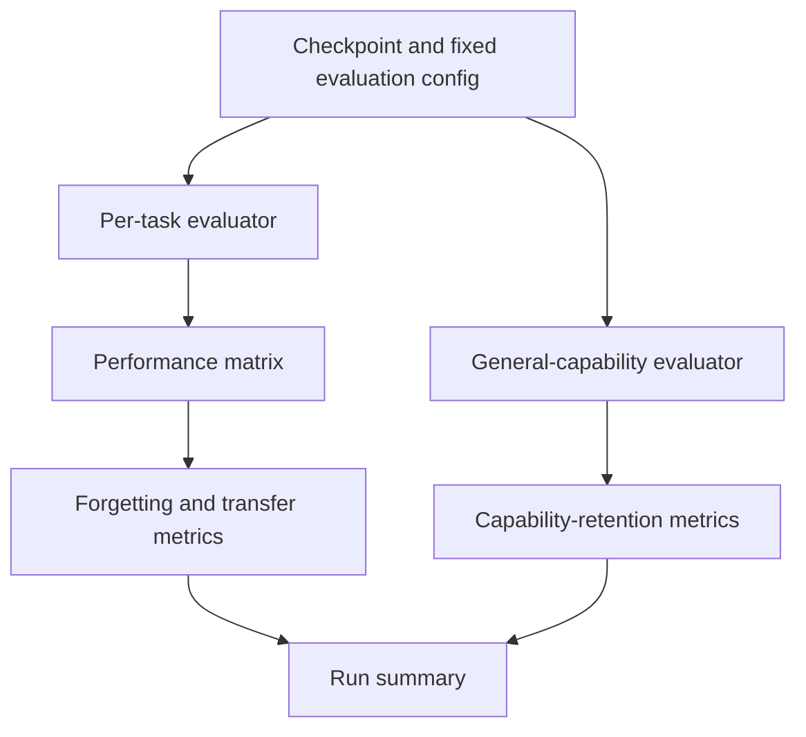

### 25.4 Continual metrics

```text
forgetting_j = max(A[i, j] for i from j to T-1) - A[T, j]

average_forgetting = mean(forgetting_j for j from 1 to T-1)

final_average_performance = mean(A[T, j] for j from 1 to T)
```

Metric implementations must be tested against hand-calculated matrices.

### 25.5 Fixed general-capability suite

Use these evaluation-only datasets:

| Capability | Dataset |
|---|---|
| Verifiable instruction following | Official IFEval |
| General knowledge and reasoning | Fixed MMLU subset |
| Commonsense completion | HellaSwag |
| Easier science capability | ARC-Easy |
| Language modelling | Fixed held-out perplexity corpus |

None of these examples may enter anchor memory or importance estimation. Official IFEval may not be used for training, reward development, prompt-template tuning, or hyperparameter selection.

Because public benchmarks may have appeared in backbone pretraining, report both absolute performance and change relative to the frozen starting model.

---

## 26. Method composition and ablations

One trainer supports all methods by composing components.

| Method | Anchor memory | Anchor KL | Parameter importance | Conflict gate | Dual controller |
|---|---:|---:|---:|---:|---:|
| Standard RL-LoRA | No | No | No | No | No |
| Current-prompt base KL | No | Base-policy KL only | No | No | Optional fixed |
| Balanced replay | Yes | Optional supervised/RL replay | No | No | No |
| EWC/SI-LoRA | No | No | Factor-level or parameter importance | No | No |
| Direct HLoRA-to-RL | No | No | Dense, static layer coefficients | Static | No |
| RAHC-LoRA | Fixed | Yes | Factorized effective-weight importance | Dynamic | Yes |

### Configuration flags

```text
use_anchor_kl
use_parameter_consolidation
use_reward_aware_importance
use_factorized_importance
use_conflict_gate
use_dual_controller
```

The `ContinualTrainer` reads a validated component bundle. It must not contain method-name conditionals scattered through the training loop.

Preferred construction:

```python
components = MethodFactory.from_config(cfg.method)
trainer = ContinualTrainer(policy=policy, tasks=tasks, components=components)
```

---

## 27. State ownership

Clear ownership prevents incomplete checkpoints and hidden coupling.

| State | Owner | Lifetime | Checkpointed |
|---|---|---|---:|
| Backbone weights | Model factory or model provider | Whole run | Reference or identifier |
| Current LoRA factors | Policy | Whole run | Yes |
| Optional value head | Policy | Whole run | Yes |
| Optimizer and scheduler | Trainer | Whole run | Yes |
| Pre-step LoRA snapshot | Importance recorder | One optimizer step | No |
| Effective-gradient summary | Gradient capture | One loss calculation or step | No |
| Importance accumulator | Importance recorder | One task and historical merge | Yes |
| Row and column importance | Consolidation state | Across tasks | Yes |
| Reference LoRA factors | Consolidation state | From one boundary to the next | Yes |
| Anchor records | Anchor memory | Across tasks under fixed budget | Yes |
| Anchor sampler RNG | Anchor memory | Whole run | Yes |
| Conflict EMA and counters | Conflict controller | Across steps | Yes, if enabled |
| KL multiplier and EMA | Dual controller | Across steps | Yes |
| Task index and global step | Continual trainer | Whole run | Yes |
| Performance matrix | Evaluator or run state | Across task boundaries | Yes |
| Resolved config | Run context | Whole run | Yes |
| Dataset fingerprints | Run manifest | Whole run | Yes |
| General RNG states | Reproducibility manager | Whole run | Yes |

Every persistent state owner implements `state_dict()` and `load_state_dict()` or a typed equivalent.

---

## 28. Checkpoint architecture

### 28.1 Checkpoint contents

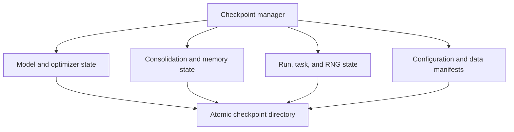

### 28.2 Atomic save protocol

1. Write to a temporary directory inside the checkpoint parent.
2. Serialize every state owner.
3. Write a manifest containing expected files, sizes, and hashes.
4. Flush and close all files.
5. Validate the temporary checkpoint.
6. Atomically rename the directory to its final name.
7. Update the latest-checkpoint pointer only after success.

Never overwrite a valid checkpoint in place.

### 28.3 Resume protocol

1. Load the checkpoint manifest.
2. Validate required files and hashes.
3. Validate model, tokenizer, dataset, and configuration compatibility.
4. Restore model and optimizer state.
5. Restore retention and memory state.
6. Restore task, step, and rollout counters.
7. Restore all RNG states.
8. Run a lightweight consistency check.
9. Continue from the next incomplete operation.

A checkpoint without anchor memory or consolidation state is invalid for resuming RAHC-LoRA.

---

## 29. Configuration architecture

### 29.1 Composition

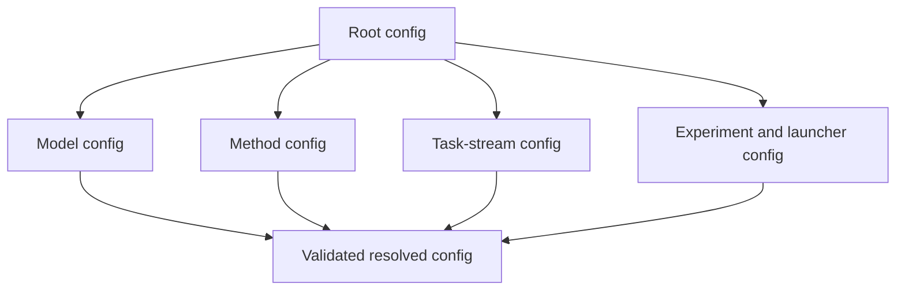

### 29.2 Validation examples

Reject configurations when:

- `use_conflict_gate=true` but anchor KL or anchor gradients are unavailable.
- `use_factorized_importance=true` but parameter consolidation is disabled and no diagnostic use is declared.
- Memory capacity is negative.
- `top_k_logits` exceeds vocabulary size.
- KL target or epsilon is nonpositive.
- LoRA rank is incompatible with target modules.
- Test and training split fingerprints overlap.
- Requested BF16 is unsupported and fallback was not explicitly allowed.
- Resume configuration changes a scientific setting not listed as safely mutable.

### 29.3 Immutability

After the run starts:

- Freeze the resolved configuration.
- Save it before training.
- Hash it into the run manifest.
- Record all command-line overrides.

---

## 30. Artifact and observability architecture

### 30.1 Run directory

```text
outputs/runs/<experiment>/<method>/<task_order>/<seed>/<run_id>/
```

### 30.2 Event categories

| Category | Examples |
|---|---|
| Learning | RL loss, reward, advantage statistics, policy KL |
| Retention | Anchor KL, old-task return, multiplier, memory composition |
| Consolidation | Importance mass, sparsity, factorization error, penalty |
| Conflict | Cosine, positive-conflict fraction, layer coefficients |
| System | Tokens per second, GPU memory, CPU memory, step time |
| Reproducibility | Config hash, data fingerprints, model revision, Git state |

### 30.3 Logging rule

Logs describe what happened. They must not be required to reconstruct essential state. Essential state belongs in checkpoints and structured artifacts.

---

## 31. Experiment orchestration

### 31.1 Run identity

A unique experimental unit is defined by:

```text
model revision
method configuration
task order
random seed
dataset fingerprints
training budget
generation configuration
```

Changing any of these creates a new run identity.

### 31.2 Sweep architecture

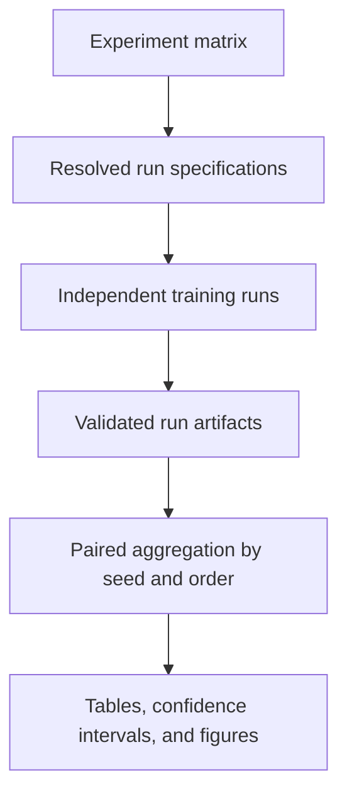

The sweep launcher schedules runs. It does not calculate scientific metrics.

### 31.3 Retry rule

A technical retry keeps the same run identity only if:

- Configuration is unchanged.
- Dataset state is unchanged.
- The run resumes from a valid checkpoint.

A run restarted with changed settings receives a new identity.

---

## 32. Runtime deployment views

### 32.1 Local development

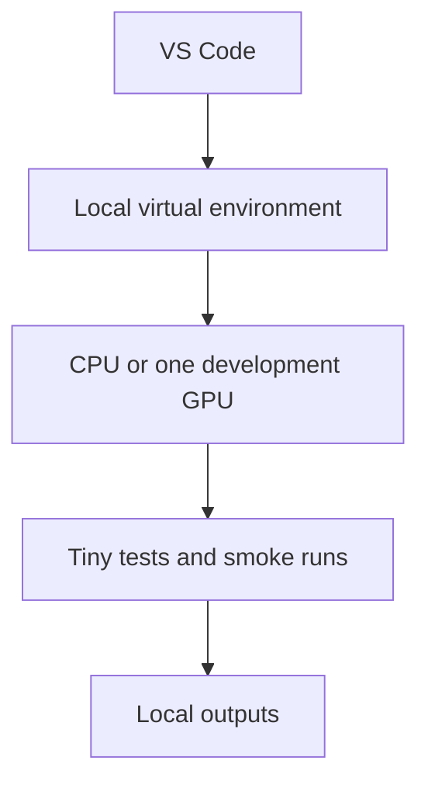

Use local development for:

- Unit tests.
- Tiny integration tests.
- Configuration debugging.
- Reward validation.
- Small numerical comparisons.

### 32.2 Remote single-GPU experiment

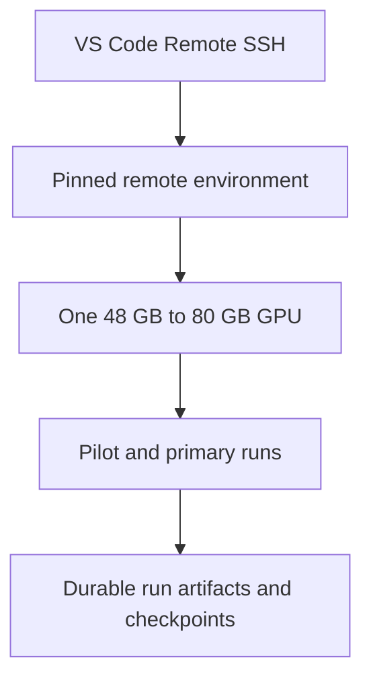

### 32.3 Multi-GPU extension

Multi-GPU support is optional until the single-GPU reference passes.

Required distributed invariants:

- LoRA gradients are synchronized correctly.
- GRPO response groups are not incorrectly split.
- Importance state is identical across ranks.
- Anchor sampling policy is deterministic and documented.
- Only one rank writes shared artifacts, followed by synchronization.
- Evaluation metrics use correct distributed reductions.

---

## 33. Memory and scaling model

### 33.1 Persistent importance

For one layer with output dimension `O` and input dimension `I`:

```text
dense importance values: O * I
rank-one factorized values: O + I
```

Example for a `4096 x 4096` projection:

```text
dense: 16,777,216 values
factorized: 8,192 values
```

This is approximately a 2,048-fold reduction for that importance matrix before dtype and metadata overhead. The reference LoRA factors are stored separately and remain low rank.

### 33.2 Anchor storage

Anchor storage is approximately:

```text
capacity
* response_positions
* top_k
* bytes_per_token_probability_entry
```

Log actual serialized bytes because metadata and variable response length make formulas approximate.

### 33.3 Runtime cost centres

Expected dominant costs, from most to least important for planning:

1. Response generation.
2. Additional current and anchor gradient passes.
3. Anchor-policy forward pass.
4. Effective-gradient capture and importance update.
5. Task-boundary evaluation.
6. Factorization and checkpoint serialization.

Profile each cost instead of assuming LoRA parameter count predicts total runtime.

---

## 34. Failure containment

### 34.1 Step-level failures

On a non-finite step:

1. Stop before mutating persistent importance or controller state.
2. Record the first failing stage and safe numeric summaries.
3. Preserve the last valid checkpoint.
4. Exit or invoke a documented retry policy.

Do not partially update LoRA weights and then skip the importance update.

### 34.2 Task-boundary failures

If evaluation or checkpointing fails:

- Keep the previous valid checkpoint.
- Do not advance the task index.
- Re-run the boundary operation idempotently.

### 34.3 Artifact failures

Optional tracking-service failure must not destroy the local run. Required local artifact failure must stop the run because results would no longer be reproducible.

---

## 35. Test architecture

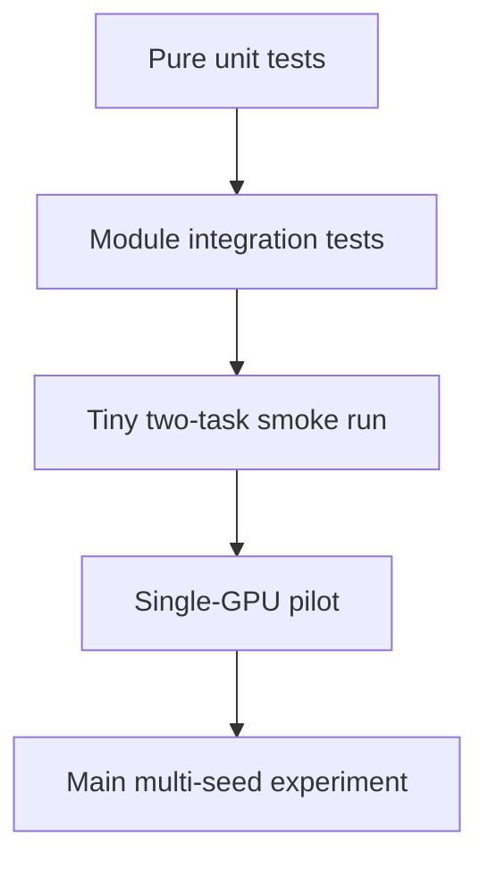

### Test boundary by component

| Component | Pure test | Integration test |
|---|---|---|
| Rewards | Hand-written response cases | Task adapter plus evaluator |
| Effective weight | Random matrix equality | Real PEFT layer |
| Importance | Synthetic gradient and step | One optimizer update |
| Factorization | Known nonnegative matrix | Task-boundary consolidation |
| Penalty | Dense versus Gram form | Backpropagation into LoRA factors |
| Anchor memory | Capacity and sampling | Task completion and rebalance |
| Compact KL | Known distributions | Current policy on anchors |
| Conflict | Aligned and opposite vectors | Separate current and anchor losses |
| Dual controller | Above and below target | Multi-step KL trajectory |
| Checkpoint | Round-trip state equality | Interrupted two-task run |
| Metrics | Hand-calculated matrix | Full evaluation row |

The main experiment is not a substitute for unit tests.

---

## 36. Extension points

The architecture may later support:

- PPO or another policy-gradient loss through the RL-loss interface.
- Higher-rank nonnegative importance factorization.
- Synthetic anchors for privacy-constrained settings.
- Continual-control environments through alternate task and policy adapters.
- Alternative conflict signals based on function-space Jacobians.
- Multiple backbones for confirmation experiments.
- Standardized experiment launchers such as Slurm.

Extensions must preserve:

- Common evaluation.
- Checkpoint completeness.
- Configuration-only ablations.
- Baseline comparability.
- Separation between task, trainer, and retention logic.

---

## 37. Architecture decisions requiring records

Create an architecture decision record in `docs/decisions` when changing:

- The effective-gradient definition.
- Importance normalization or clipping order.
- Historical importance merge policy.
- Compact-KL approximation.
- Anchor selection algorithm.
- Distributed reduction order.
- Task split construction.
- Metric definitions.
- Checkpoint compatibility.
- Method-component ownership.

An architecture decision record should include:

```text
Context
Decision
Alternatives considered
Scientific consequences
Engineering consequences
Validation required
Date and author
```

---

## 38. Worked example

Assume the system has completed mathematics and is now learning science.

1. The mathematics task boundary stored 512 balanced anchors, mathematics reference behaviour, factorized importance, and reference LoRA factors.
2. The trainer samples science prompts and generates several responses for each prompt.
3. The science reward adapter scores the answers.
4. GRPO converts relative rewards into normalized advantages.
5. The trainer computes the science RL loss.
6. The anchor memory samples mathematics prompts.
7. The current policy is evaluated on those prompts.
8. The distillation module measures drift from stored mathematics behaviour.
9. The gradient-capture module estimates science and mathematics-retention directions per protected layer.
10. A layer receives a positive conflict coefficient only if the science direction opposes the mathematics-retention direction.
11. The penalty module resists movement away from important mathematics effective weights in those conflicting layers.
12. The dual controller strengthens behavioural KL if mathematics-anchor drift exceeds its budget.
13. The optimizer updates the shared LoRA policy.
14. The importance recorder measures which effective science-related movements helped the RL objective.
15. After science training, the system merges new importance, refreshes the global 512-anchor memory, and stores science reference behaviour.
16. The evaluator scores both mathematics and science.
17. The new performance-matrix row shows whether science was learned and how much mathematics was forgotten.

This example shows why every subsystem is necessary to test the central claim.

---

## 39. Architecture acceptance checklist

The implementation conforms to this architecture only when:

- One frozen backbone and one shared LoRA policy are used in the primary method.
- Standard RL-LoRA is identical to first-task RAHC-LoRA when no retention state exists.
- Effective LoRA scaling is applied exactly once.
- Importance is based on the actual observed optimizer step.
- Persistent importance is factorized in the main method.
- Dense implementations exist only as reference or explicit baseline modes.
- Anchor memory has a hard capacity and never receives final test examples.
- Behavioural KL uses stored reference behaviour, not a moving current target.
- Conflict coefficients are based on separate current and anchor gradients and are detached.
- The dual controller is bounded and checkpointed.
- Every state owner supports save and load.
- Evaluation cannot mutate training or retention state.
- Every task boundary produces a performance-matrix row and complete checkpoint.
- Baselines and ablations use the same trainer infrastructure.
- Run artifacts are sufficient to reproduce every headline result.
- Security boundaries exist for generated-code rewards.
- Unit and integration tests cover all core equations.

---

## 40. Final architecture summary

RAHC-LoRA is one sequential RL training system with three coordinated loops:

1. **Learning loop:** generate, reward, calculate advantages, and update the shared LoRA policy.
2. **Retention loop:** compare old behaviour, detect gradient conflict, and apply functional and parameter protection.
3. **Evidence loop:** evaluate all tasks, checkpoint all state, and preserve reproducible experiment artifacts.

The learning loop provides plasticity. The retention loop provides stability. The evidence loop determines whether the balance actually works.
